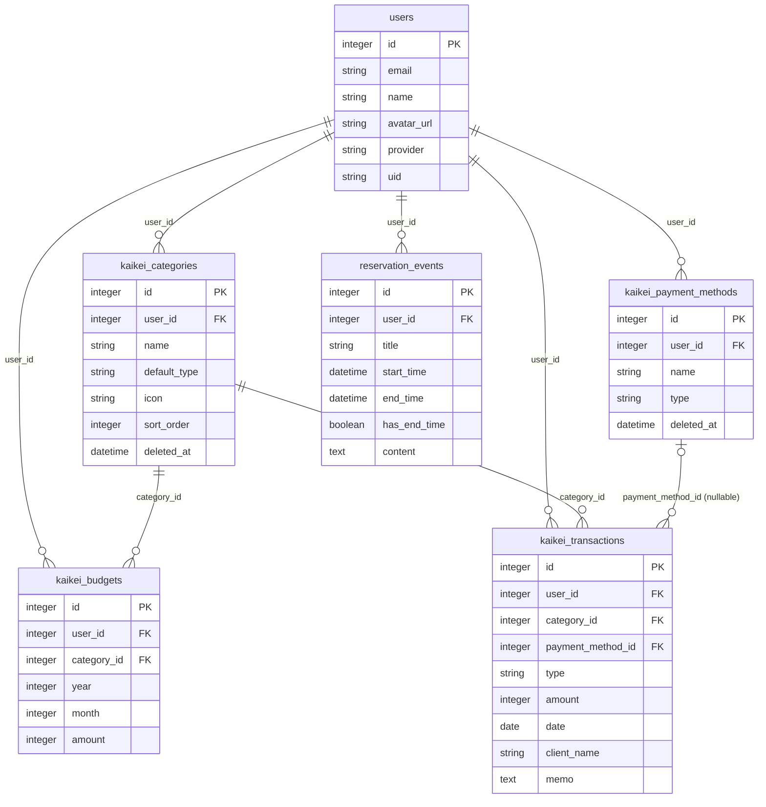

# er.md — vps-rails DB ER ドキュメント(恒久)

`db/schema.rb`(2026_07_12_160000 時点)を元にした全テーブル・カラム・
リレーション・外部キーの一覧。機能追加やデータ移行のたびに読み直す前提の
恒久ドキュメントなので、スキーマ変更時(マイグレーション追加時)は必ず
このドキュメントも更新すること。

対象範囲: `users`(共通)、`kaikei_*`(会計アプリ)、`reservation_events`
(予約カレンダー)。Active Storage 関連テーブルは未導入(スキーマに存在しない)。

---

## 1. ER図

---

## 2. user_id の持ち方 — 全テーブル直接保持(重要)

**この DB には「親経由でしか user に紐づかない」テーブルは存在しない。**
`kaikei_categories` / `kaikei_payment_methods` / `kaikei_budgets` /
`kaikei_transactions` / `reservation_events` の **5テーブル全てが
`user_id` を直接持つ**。

これは一見冗長に見えるが、実際にはコントローラが常に
`current_user.kaikei_categories` / `current_user.kaikei_transactions` の
ように**それぞれ独立して** `current_user` からスコープしているため
(`app/controllers/kaikei/*.rb`, `app/controllers/reservation/events_controller.rb`
参照)、`kaikei_transactions.user_id` を変えても
`kaikei_categories.user_id` は自動的には追随しない。

具体例(誤りやすいポイント): 「取引(`kaikei_transactions`)の `user_id` を
新ユーザーに変えれば、取引が参照している科目(`kaikei_categories`、
`category_id` 経由)は取引からしか見えないので影響ない」という発想は
**誤り**。科目は取引とは別に `kaikei_categories.user_id` で独立して
ユーザーに紐づいており、科目一覧・予算作成のプルダウン・設定画面
(`current_user.kaikei_categories`)は取引を経由せず直接
`kaikei_categories.user_id` でスコープされる。取引の `user_id` だけ
変えて科目の `user_id` を変えなければ、新ユーザーの画面には
「取引はあるが科目一覧には出てこない科目」という不整合状態が生まれる
(取引側は `belongs_to :category, -> { unscope(where: :deleted_at) }`
で科目を直参照するため表示上のエラーにはならないが、科目マスタとしては
新ユーザーの所有物になっていない)。

→ 「ある user の所有物をまるごと別 user に付け替える」操作
(`docs/db/user-id-reassignment.md`)は、**この5テーブル全てを揃えて
更新する必要がある**。1テーブルだけ更新すれば済むケースはこのスキーマには
存在しない。

`category_id` / `payment_method_id` 自体(参照先レコードのID)は
所有者付け替えでは変更不要。変更するのは各テーブルの `user_id` 列のみ。

---

## 3. テーブル定義

### 3.1 `users`(共通、名前空間なし)

| カラム | 型 | NULL | 備考 |
|---|---|---|---|
| id | integer | NOT NULL | PK |
| email | string | NOT NULL | |
| name | string | NULL | |
| avatar_url | string | NULL | |
| provider | string | NOT NULL | Google OAuth プロバイダ名(`google_oauth2`) |
| uid | string | NOT NULL | Google アカウントの一意ID |
| created_at / updated_at | datetime | NOT NULL | |

- 一意インデックス: `(provider, uid)` — 同一 Google アカウントに対して
  User 行は必ず1件のみ(`User.from_google_omniauth` が
  `find_or_create_by(provider:, uid:)` で突合)
- **`provider` / `uid` は Google が発行する識別子そのものであり、
  アプリ側の都合で書き換えてはいけない**(書き換えると別の Google
  アカウントを乗っ取ったのと同じ状態になる、または本来のアカウントで
  ログインできなくなる)

### 3.2 `kaikei_categories`(科目マスタ、ユーザーごとに分離)

| カラム | 型 | NULL | 備考 |
|---|---|---|---|
| id | integer | NOT NULL | PK |
| user_id | integer | NOT NULL | FK → `users.id`(直接保持) |
| name | string | NOT NULL | |
| default_type | string | NOT NULL | CHECK `IN ('income','expense')` |
| icon | string | NULL | |
| sort_order | integer | NOT NULL (default 0) | |
| deleted_at | datetime | NULL | 論理削除(`discard`) |
| created_at / updated_at | datetime | NOT NULL | |

- インデックス: `user_id`, `deleted_at`
- FK: `user_id → users.id`(`on_delete` 指定なし = RESTRICT。参照している
  行がある間は `users` 側を DELETE できない)
- `belongs_to :user` は default_scope の影響を受けない通常の関連

### 3.3 `kaikei_payment_methods`(支払方法マスタ、ユーザーごとに分離)

| カラム | 型 | NULL | 備考 |
|---|---|---|---|
| id | integer | NOT NULL | PK |
| user_id | integer | NOT NULL | FK → `users.id`(直接保持) |
| name | string | NOT NULL | |
| type | string | NOT NULL | CHECK `IN ('income','expense')`。カラム名 `type` だが `self.inheritance_column = nil` で STI 無効化済み |
| deleted_at | datetime | NULL | 論理削除(`discard`) |
| created_at / updated_at | datetime | NOT NULL | |

- インデックス: `user_id`, `deleted_at`
- FK: `user_id → users.id`(RESTRICT)

### 3.4 `kaikei_budgets`(予算、支出科目のみ)

| カラム | 型 | NULL | 備考 |
|---|---|---|---|
| id | integer | NOT NULL | PK |
| user_id | integer | NOT NULL | FK → `users.id`(直接保持) |
| category_id | integer | NOT NULL | FK → `kaikei_categories.id`。アプリ側バリデーションで `default_type = expense` のみ許可(DB制約ではない) |
| year | integer | NOT NULL | 上限なし |
| month | integer | NOT NULL | CHECK `BETWEEN 1 AND 12` |
| amount | integer | NOT NULL | CHECK `>= 1`。円単位の整数 |
| created_at / updated_at | datetime | NOT NULL | |

- 一意インデックス: `(user_id, category_id, year, month)`
- インデックス: `category_id`, `user_id`
- FK: `user_id → users.id`(RESTRICT)、`category_id → kaikei_categories.id`(RESTRICT)
- 物理削除(論理削除ではない)

### 3.5 `kaikei_transactions`(取引、物理削除)

| カラム | 型 | NULL | 備考 |
|---|---|---|---|
| id | integer | NOT NULL | PK |
| user_id | integer | NOT NULL | FK → `users.id`(直接保持) |
| category_id | integer | NOT NULL | FK → `kaikei_categories.id`(RESTRICT)。アプリ側バリデーションで `type` が科目の `default_type` と一致必須 |
| payment_method_id | integer | NULL | FK → `kaikei_payment_methods.id`、**`on_delete: :nullify`**(支払方法が削除されると自動で NULL になる。DB制約) |
| type | string | NOT NULL | CHECK `IN ('income','expense')` |
| amount | integer | NOT NULL | CHECK `>= 0`。円単位の整数、税区分なし |
| date | date | NOT NULL | |
| client_name | string | NULL | 自由テキスト(専用マスタなし) |
| memo | text | NULL | |
| created_at / updated_at | datetime | NOT NULL | |

- インデックス: `user_id`, `category_id`, `payment_method_id`
- `belongs_to :category` / `belongs_to :payment_method` は
  `-> { unscope(where: :deleted_at) }` で default_scope を外して参照
  (論理削除済みでも過去取引から科目名・支払方法名が引ける)

### 3.6 `reservation_events`(予約カレンダー、物理削除)

| カラム | 型 | NULL | 備考 |
|---|---|---|---|
| id | integer | NOT NULL | PK |
| user_id | integer | NOT NULL | FK → `users.id`(直接保持) |
| title | string | NULL | |
| start_time | datetime | NULL | |
| end_time | datetime | NULL | |
| has_end_time | boolean | NOT NULL (default false) | |
| content | text | NULL | |
| created_at / updated_at | datetime | NOT NULL | |

- インデックス: `user_id`
- FK: `user_id → users.id`(RESTRICT)

---

## 4. 外部キー制約一覧(`on_delete` 挙動)

| FK | 参照元 → 参照先 | `on_delete` | 実際の挙動 |
|---|---|---|---|
| `kaikei_categories.user_id` | → `users.id` | 指定なし(RESTRICT) | 参照が残っていると `users` 行を DELETE できない |
| `kaikei_payment_methods.user_id` | → `users.id` | 指定なし(RESTRICT) | 同上 |
| `kaikei_budgets.user_id` | → `users.id` | 指定なし(RESTRICT) | 同上 |
| `kaikei_budgets.category_id` | → `kaikei_categories.id` | 指定なし(RESTRICT) | 予算がある科目は削除できない(科目は論理削除のみなので通常問題にならない) |
| `kaikei_transactions.user_id` | → `users.id` | 指定なし(RESTRICT) | 参照が残っていると `users` 行を DELETE できない |
| `kaikei_transactions.category_id` | → `kaikei_categories.id` | 指定なし(RESTRICT) | 同上(科目は論理削除のみ) |
| `kaikei_transactions.payment_method_id` | → `kaikei_payment_methods.id` | **`nullify`** | 支払方法が DELETE されると取引側は自動で NULL |
| `reservation_events.user_id` | → `users.id` | 指定なし(RESTRICT) | 参照が残っていると `users` 行を DELETE できない |

**`users` を DB レベルで DELETE できるのは、5テーブル全てから当該
`user_id` の行が消えた後だけ**(RESTRICT のため)。アプリ側の
`User` モデルは `has_many ..., dependent: :destroy` で関連を辿って
`.destroy_all` するが、`kaikei_categories` / `kaikei_payment_methods` の
`has_many` は **モデルの `default_scope { where(deleted_at: nil) }` の
影響を受ける**ため、**論理削除済み(discard 済み)の科目・支払方法は
`dependent: :destroy` の対象に含まれない**。つまり、論理削除済みの
科目・支払方法が1件でも残っている状態で `User#destroy` を呼ぶと、
それらの行が孤立したまま `users` 側の DELETE が FK 違反で失敗する。
`user_id` の付け替え・削除を伴う運用では必ずこの点を考慮すること
(`Kaikei::Category.unscoped` / `Kaikei::PaymentMethod.unscoped` で
論理削除済みの行も含めて操作する必要がある)。

---

## 5. その他の非DB制約(アプリ側のみで保証されている前提)

DB のスキーマ・FK だけでは表現されておらず、アプリのコントローラが
常に `current_user` 経由でレコードを作成することによってのみ保たれている
前提条件。生SQLや `update_all` で直接操作する場合は自分で担保する必要がある。

- `kaikei_transactions.user_id` と、その `category_id` が指す
  `kaikei_categories.user_id` は常に一致する(DB制約なし)
- `kaikei_transactions.user_id` と、その `payment_method_id` が指す
  `kaikei_payment_methods.user_id` は常に一致する(DB制約なし)
- `kaikei_budgets.user_id` と、その `category_id` が指す
  `kaikei_categories.user_id` は常に一致する(DB制約なし)
